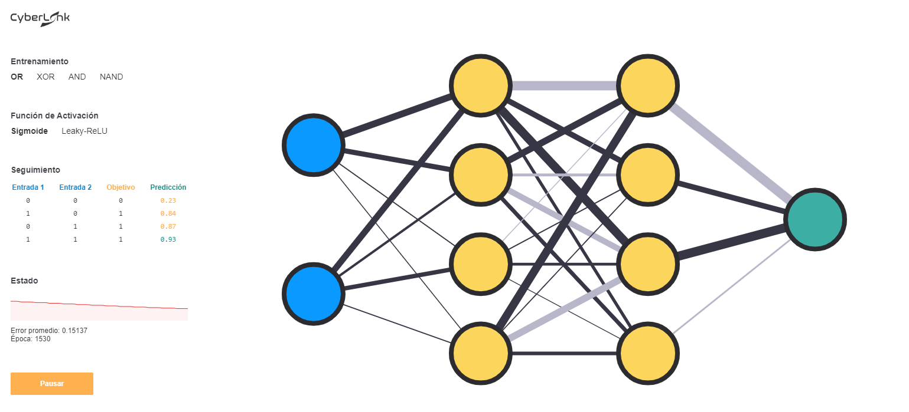

# CyberLink
CyberLink es una herramienta que apoya la compresión y el aprendizaje sobre el funcionamiento de redes neuronales artificiales a través de la visualización en tiempo real de una red neuroral en ejecución.

## Requisitos
Debe contar con Node.js en su sistema antes de poder utilizar esta herramienta, se recomienda la versión 12 de Node.js: https://nodejs.org
## Instalación de dependencias
Para instalar las dependencias del proyecto clone este repositorio en su sistema y acceda a la raíz del proyecto, en este directorio ejecute el siguiente comando:
```bash
npm install
```
## Ejecución
Una vez instaladas las dependencias, ejecute el siguiente comando para compilar y ejecutar la aplicación:
```bash
npm start
```
La aplicación le informará cuando las tareas de compilación hayan finalizado, usted podrá accesar la aplicación en http://localhost:4000 
## Entrenamiento
Por simplicidad, CyberLink utiliza las tablas de verdad de las compuertas lógicas OR, XOR, AND y NAND como sus conjuntos de entrenamiento. Al seleccionar un conjunto de entrenamiento en el menú, podrá ver que la tabla de seguimiento se actualiza con los datos correspondientes a ese entrenamiento.
## Tabla de seguimiento
La tabla de seguimiento presenta los datos que el sistema está ingresando en la red, la salida que se espera que la red genere y la salida que la red está generando al momento, esta última es permite conocer el estado actual de la red y qué tan lejos o cerca se está de la convergencia.
## Funciones de activación
Por motivos de desmostración, CyberLink cuenta con dos funciones de activación: la función Sigmoide y Leaky-ReLU. Puede aprender con mayor detalle sobre estas funciones [aquí](https://en.wikipedia.org/wiki/Activation_function)
## Error promedio
El error de una red neuronal cuantifica la disparidad de la salida esperada con respecto a la salida de la red, esta información es útil para medir el progreso de la red en su camino a la convergencia.
## Agradecimientos
Agradezco el trabajo de Matt Mazur, el cual me ayudó a comprender matemáticamente el funcionamiento de las redes neuronales, puede consultar su trabajo [aquí](https://mattmazur.com/2015/03/17/a-step-by-step-backpropagation-example/)
## Notas
1. CyberLink tiene la capacidad de generar topologías de red neuronal a través de un arreglo de topología, si desea modificar la topología del proyecto asegurese de no exceder 4 capas de neuronas ocultas, ya que la carga computacional crece substancialmente.
1. La función de activación Leaky-ReLU es sensible a muchos parámetros de la red y tiene una mayor probabilidad de quedarse en mínimos locales, se recomiendan por lo menos 2 capas ocultas cuando se trabaje con esta función.
